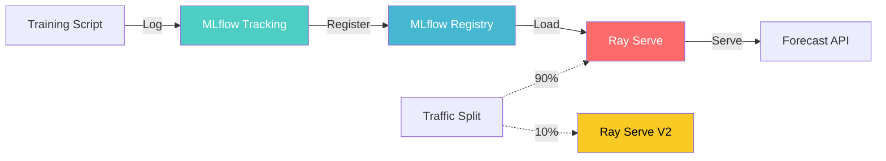

# Ray Serve + MLflow MLOps Pipeline

An end-to-end MLOps pipeline using Ray Serve for model serving and MLflow for experiment tracking and model registry.

## Features

- 🚀 **Ray Serve** - Model serving with autoscaling & batching
- 📊 **MLflow** - Experiment tracking & model registry
- 🔄 **Canary Deployment** - Traffic splitting between model versions
- 📦 **Model Versioning** - Auto-load latest production model
- 🔍 **Lineage Tracking** - Trace model back to training run

## Architecture



## Tech Stack

- **Ray Serve** - Distributed model serving
- **MLflow** - ML lifecycle management
- **FastAPI** - API framework (integrated with Ray Serve)
- **scikit-learn** - ML library (demo model)
- **uv** - Python package manager

## Installation

```bash
# Clone the repo
git clone https://github.com/anderhong/ray-serve-mlflow.git
cd ray-serve-mlflow

# Install dependencies
uv sync

# Start MLflow server (Terminal 1)
uv run mlflow ui --port 5000

# Train & register model (Terminal 2)
uv run python train_dummy_model.py

# Run Ray Serve (Terminal 2)
uv run serve run forecast_rayserve:forecast_app
```

## Usage

### Test the Forecast API

```bash
curl -X POST http://localhost:8000/forecast \
  -H "Content-Type: application/json" \
  -d '{"temperature": 22}'
```

Response:
```json
{"prediction": 220.0}
```

### Canary Deployment

```bash
# Deploy both versions with traffic split
uv run serve run deploy_config.yaml
```

`deploy_config.yaml`:
```yaml
applications:
  - name: forecast_v1
    import_path: forecast_rayserve:forecast_app
    route_prefix: /v1
    traffic_split: 0.9
  - name: forecast_v2
    import_path: forecast_rayserve_v2:forecast_app
    route_prefix: /v2
    traffic_split: 0.1
```

## Ray Serve Features

### Autoscaling

```python
@serve.deployment(
    autoscaling_config={
        "min_replicas": 1,
        "max_replicas": 3,
        "target_num_ongoing_requests_per_replica": 5
    }
)
```

### Batching

```python
@serve.batch(max_batch_size=4, batch_wait_timeout_s=1.0)
async def predict_batch(self, requests):
    # Process multiple requests together
    ...
```

## MLflow Features

### Model Registry

- Register models with versions
- Use aliases (e.g., "production") to mark deployment stage
- Auto-load latest production model in Ray Serve

```python
model_uri = "models:/ForecastModel/production"
model = mlflow.sklearn.load_model(model_uri)
```

### Lineage Tracking

```bash
uv run python trace_model.py
```

Output:
```
📦 Model: ForecastModel (Version 1)
🔗 Source Run ID: aef3c856...
📊 Parameters:
  - model_type: LinearRegression
📈 Metrics:
  - coefficient: 10.0
  - intercept: 0.0
```

## Project Structure

```
rayserve/
├── forecast_rayserve.py      # V1 Ray Serve app
├── forecast_rayserve_v2.py   # V2 Ray Serve app (loads from MLflow)
├── train_dummy_model.py      # Training script
├── trace_model.py            # MLflow lineage tracer
├── deploy_config.yaml        # Traffic split config
├── pyproject.toml
└── README.md
```

## Key Learnings

- **Autoscaling**: Ray Serve automatically scales replicas based on queue length
- **Batching**: Multiple requests are combined for better GPU/CPU utilization
- **Model Registry**: Central place to manage model versions
- **Canary Deployment**: Safely roll out new models with traffic splitting
- **Lineage**: Trace production models back to their training runs

## License

MIT